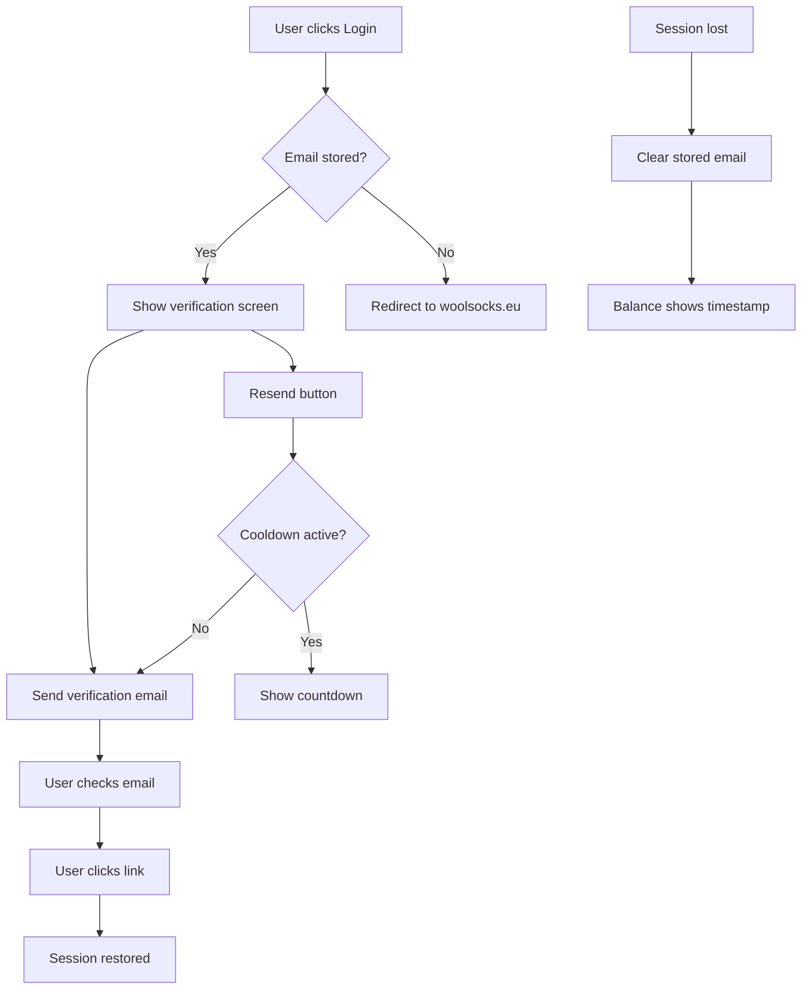

# Session Recovery Flow

## Overview
The session recovery feature enables users to restore their authentication without leaving the extension by storing their email locally and sending verification emails directly.

## Flow Diagram

## Technical Implementation

### 1. Email Storage
- **Trigger**: When `getUserId()` returns real user ID AND `/user-info/api/v0` returns email
- **Storage**: `chrome.storage.local` with key `__wsUserEmail`
- **Format**: `{ email: string, timestamp: number, metadata?: { userId?: string } }`
- **Security**: Browser encrypts at rest, stored in plain text

### 2. Verification Email API
- **Endpoint**: `POST /identity-new/api/v2/email/authenticate`
- **Method**: Direct API call via `fetchViaSiteProxy`
- **Cooldown**: 60 seconds between sends
- **Analytics**: Track success/failure with email domain

### 3. UI Components
- **VerificationEmailScreen**: Shows masked email and resend button
- **Email masking**: `jv***@apcreation.nl` format
- **Balance timestamp**: "Last updated: 2 hours ago" format
- **Settings integration**: "Forget Me" button with confirmation

### 4. Analytics Events
- `session_recovery_email_stored` - When email is stored
- `session_recovery_email_cleared` - When email is cleared
- `verification_email_triggered` - When verification is requested
- `verification_email_success` - When email sent successfully
- `verification_email_fail` - When email sending fails
- `verification_screen_shown` - When verification screen displayed
- `verification_resend_clicked` - When resend button clicked

## User Experience

### Before (Old Flow)
1. User clicks "Login" → Redirects to woolsocks.eu
2. User logs in → Returns to extension
3. Session lost → Must repeat entire process

### After (New Flow)
1. User clicks "Login" → Shows verification screen with stored email
2. Verification email sent automatically → User checks email
3. User clicks link → Session restored seamlessly
4. If no email stored → Falls back to woolsocks.eu redirect

## Success Criteria
- ✅ Users can trigger verification emails without leaving extension
- ✅ Cached balance shows "last updated" timestamp after session loss
- ✅ Email stored automatically on login, cleared on logout
- ✅ Verification screen matches design (paper plane icon, email display)
- ✅ 60-second resend cooldown prevents spam
- ✅ Analytics track all key events
- ✅ Fallback to woolsocks.eu redirect when no email stored

## Files Modified
- `src/shared/email-storage.ts` (new)
- `src/shared/time-utils.ts` (new)
- `src/shared/VerificationEmailScreen.tsx` (new)
- `src/background/api.ts`
- `src/background/index.ts`
- `src/popup/main.tsx`
- `src/options/main.tsx`
- `src/options/SettingsPanel.tsx`

## Testing Checklist
- [ ] Email automatically stored on login
- [ ] Verification screen appears when email stored
- [ ] Verification email sent successfully
- [ ] Resend cooldown works correctly
- [ ] Balance timestamp displays after session loss
- [ ] "Forget Me" button clears stored email
- [ ] Fallback to woolsocks.eu when no email stored
- [ ] All analytics events tracked correctly
